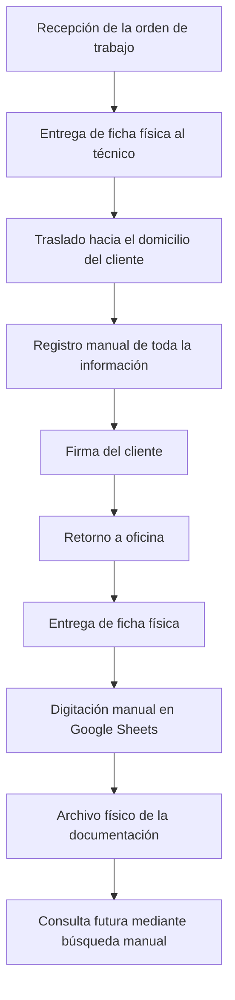
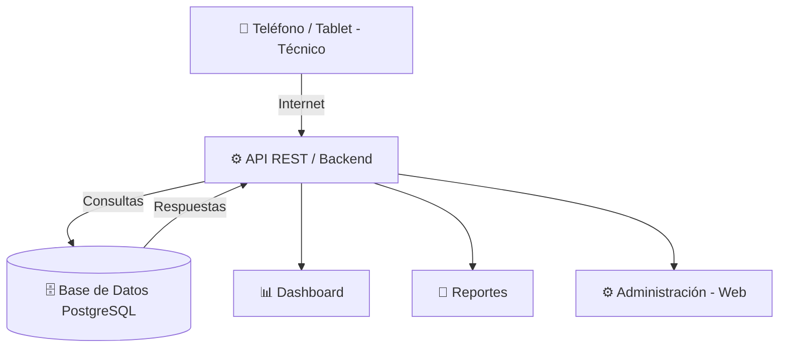
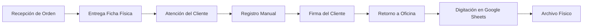
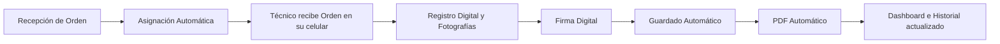

# 🚀 PROPUESTA DE IMPLEMENTACIÓN DE UN SISTEMA INTELIGENTE DE GESTIÓN DE ÓRDENES DE SERVICIO TÉCNICO

> **Proyecto de Transformación Digital para la Gestión de Órdenes de Servicio**
> 
> **Autor:** CRISTIAN ZAVALETA BURGOS

---

## 📑 ÍNDICE

1. [Introducción](#1-introducción)
2. [Antecedentes](#2-antecedentes)
3. [Descripción de la empresa](#3-descripción-de-la-empresa)
4. [Situación actual](#4-situación-actual)
5. [Análisis del proceso actual](#5-análisis-del-proceso-actual)
6. [Evidencias del proceso actual](#6-evidencias-del-proceso-actual)
7. [Diagnóstico de la problemática](#7-diagnóstico-de-la-problemática)
8. [Problemas identificados](#8-problemas-identificados)
9. [Impacto en la empresa](#9-impacto-en-la-empresa)
10. [Conclusiones del diagnóstico](#10-conclusiones-del-diagnóstico)
11. [Objetivo general](#11-objetivo-general)
12. [Objetivos específicos](#12-objetivos-específicos)
13. [Alcance del proyecto](#13-alcance-del-proyecto)
14. [Justificación del proyecto](#14-justificación-del-proyecto)
15. [Solución propuesta](#15-solución-propuesta)
16. [Arquitectura general del sistema](#16-arquitectura-general-del-sistema)
17. [Tecnologías propuestas](#17-tecnologías-propuestas)
18. [Módulos del sistema](#18-módulos-del-sistema)
19. [Proceso actual (AS-IS)](#19-proceso-actual-as-is)
20. [Proceso propuesto (TO-BE)](#20-proceso-propuesto-to-be)
21. [Beneficios esperados](#21-beneficios-esperados)
22. [Conclusión de la Parte II](#22-conclusión-de-la-parte-ii)
23. [Diseño funcional del sistema](#23-diseño-funcional-del-sistema)
24. [Diseño de las principales pantallas](#24-diseño-de-las-principales-pantallas)
25. [Diseño de la base de datos](#25-diseño-de-la-base-datos)
26. [Dashboard Ejecutivo](#26-dashboard-ejecutivo)
27. [Reportes Automáticos](#27-reportes-automáticos)
28. [Integración con Google Sheets](#28-integración-con-google-sheets)
29. [Implementación de OCR](#29-implementación-de-ocr)
30. [Implementación de Inteligencia Artificial](#30-implementación-de-inteligencia-artificial)
31. [Seguridad del Sistema](#31-seguridad-del-sistema)
32. [Cronograma de Implementación](#32-cronograma-de-implementación)
33. [Análisis Costo – Beneficio](#33-análisis-costo--beneficio)
34. [Comparación del Proceso](#34-comparación-del-proceso)
35. [Impacto Esperado](#35-impacto-esperado)
36. [Conclusiones Finales](#36-conclusiones-finales)

---

<h2 align="center">PARTE I – Diagnóstico y Análisis de la Situación Actual</h2>

### 1. INTRODUCCIÓN

Actualmente, muchas empresas de servicios técnicos continúan gestionando sus órdenes de trabajo mediante documentos físicos. Aunque este método ha sido utilizado durante muchos años, el crecimiento del volumen de clientes y la necesidad de disponer de información en tiempo real han evidenciado múltiples limitaciones relacionadas con la **productividad**, la **trazabilidad** y la **calidad de la información**.

La empresa objeto de este estudio utiliza fichas impresas para registrar cada servicio técnico realizado en campo. Posteriormente, dichas fichas son entregadas al área administrativa, donde nuevamente se registra toda la información en una hoja de cálculo de Google Sheets.

Este procedimiento genera una duplicidad de trabajo, incrementa la posibilidad de cometer errores y retrasa la disponibilidad de la información para las diferentes áreas de la organización.

Ante esta situación, surge la necesidad de implementar un **Sistema Inteligente de Gestión de Órdenes de Servicio Técnico** que permita digitalizar completamente el proceso operativo, eliminando el uso del papel y mejorando significativamente la eficiencia de la empresa.

---

### 2. ANTECEDENTES

Durante varios años la empresa ha utilizado formularios impresos para documentar las instalaciones, mantenimientos, averías y demás servicios técnicos prestados a sus clientes. 

El procedimiento consiste en que el técnico complete manualmente toda la información relacionada con la atención realizada, incluyendo:
- Datos personales del cliente
- Dirección
- Materiales utilizados
- Observaciones
- Firmas y conformidad del servicio

Posteriormente, estas fichas son archivadas físicamente y otra persona vuelve a ingresar manualmente toda la información en Google Sheets. 

Aunque este procedimiento ha permitido mantener un registro básico de las atenciones, actualmente presenta múltiples limitaciones debido al crecimiento de la empresa y al incremento constante del número de órdenes de servicio.

---

### 3. DESCRIPCIÓN DE LA EMPRESA

La empresa se dedica a brindar servicios técnicos relacionados con instalaciones, mantenimiento y atención de averías. Cada día los técnicos realizan múltiples visitas a diferentes clientes, donde registran información importante como:

- 👤 **Datos del cliente**
- 📍 **Dirección**
- 🔢 **Código del suministro**
- 🛠️ **Tipo de servicio**
- 📦 **Materiales utilizados**
- 📝 **Observaciones técnicas**
- 📊 **Estado del servicio**
- ✍️ **Firma del cliente y técnico**

Toda esta información resulta fundamental para garantizar la trazabilidad de los servicios y mantener un historial adecuado de cada cliente. Sin embargo, debido a que el proceso continúa realizándose mediante documentos físicos, la gestión de la información presenta importantes deficiencias operativas.

---

### 4. SITUACIÓN ACTUAL

Después de analizar el flujo de trabajo utilizado actualmente por la empresa, se identificó que todo el proceso depende principalmente del uso de fichas físicas.

1. El procedimiento inicia cuando el técnico recibe una orden de trabajo.
2. Durante la atención, el técnico registra manualmente toda la información solicitada en la ficha impresa.
3. Una vez finalizado el servicio, la ficha es firmada por el cliente y posteriormente trasladada a la oficina administrativa.
4. Finalmente, el personal administrativo vuelve a registrar manualmente toda la información en Google Sheets.

> [!WARNING]
> Como consecuencia, una misma información es escrita **dos veces** antes de quedar disponible para su consulta. Este proceso incrementa considerablemente el tiempo de procesamiento de cada orden y representa una importante pérdida de productividad para la organización.

---

### 5. ANÁLISIS DEL PROCESO ACTUAL

El flujo operativo actualmente utilizado por la empresa puede resumirse de la siguiente manera:

Este procedimiento presenta múltiples actividades repetitivas que no agregan valor al proceso y generan retrasos innecesarios.

---

### 6. EVIDENCIAS DEL PROCESO ACTUAL

Durante el levantamiento de información se observaron las siguientes evidencias:

#### 📄 Evidencia 1: Fichas físicas
Las órdenes de servicio son registradas manualmente mediante formularios impresos. Estas fichas contienen información como datos personales, teléfonos, dirección, materiales, observaciones y firmas. Cada ficha debe conservarse físicamente para futuras consultas.

#### 💻 Evidencia 2: Registro en Google Sheets
Después del trabajo de campo, toda la información vuelve a ser digitada manualmente. Esto genera:
- Doble trabajo.
- Retrasos.
- Posibles errores.
- Mayor carga administrativa.

#### 🗄️ Evidencia 3: Archivo físico
Las fichas son almacenadas en archivadores. Con el paso del tiempo aumenta considerablemente el número de documentos físicos, dificultando la búsqueda y ocupando espacio dentro de la empresa.

---

### 7. DIAGNÓSTICO DE LA PROBLEMÁTICA

Como resultado del análisis realizado, se determinó que la empresa presenta un proceso altamente manual, repetitivo y dependiente del papel.

Aunque Google Sheets funciona como repositorio digital, no elimina la necesidad de volver a registrar la información. Por esta razón, el sistema actual **no puede considerarse completamente digital**.

Además, la información no se encuentra centralizada ni integrada con herramientas que permitan obtener indicadores automáticos, reportes inteligentes o seguimiento en tiempo real de las actividades realizadas por los técnicos. 

> [!CAUTION]
> En consecuencia, la empresa presenta una **baja madurez tecnológica** en el proceso de gestión de órdenes de servicio.

---

### 8. PROBLEMAS IDENTIFICADOS

| # | Problema | Descripción |
|---|----------|-------------|
| 1 | **Doble digitación** | La misma información es registrada dos veces. |
| 2 | **Pérdida de tiempo** | Cada orden requiere nuevamente ser digitada en oficina. |
| 3 | **Errores humanos** | Existe riesgo de registrar datos incorrectos al pasar a digital. |
| 4 | **Dependencia del papel** | Toda la operación depende de documentos físicos. |
| 5 | **Búsquedas lentas** | Encontrar información histórica puede tomar varios minutos o horas. |
| 6 | **Falta de trazabilidad** | No existe un expediente digital único por cliente. |
| 7 | **Ausencia de indicadores** | No existen dashboards ni estadísticas automáticas. |
| 8 | **Baja productividad** | El personal dedica gran parte de su jornada únicamente a transcribir información. |

---

### 9. IMPACTO EN LA EMPRESA

Las deficiencias identificadas generan consecuencias directas en la operación diaria:
- 📈 Incremento del tiempo de atención administrativa.
- 💰 Mayor costo operativo por duplicidad de tareas.
- ⚠️ Riesgo de pérdida de información.
- 🐌 Dificultad para responder rápidamente a consultas de los clientes.
- 📉 Baja capacidad para generar reportes gerenciales.
- 🔍 Escasa trazabilidad de los servicios realizados.
- 📉 Poca disponibilidad de información para la toma de decisiones.
- 🚫 Limitada capacidad de crecimiento debido a procesos manuales.

---

### 10. CONCLUSIONES DEL DIAGNÓSTICO

El análisis del proceso actual evidencia que la empresa mantiene un modelo de trabajo tradicional basado en documentos físicos y registros manuales. Aunque el uso de Google Sheets representa un primer paso hacia la digitalización, **no elimina la duplicidad de tareas ni resuelve los problemas de trazabilidad, búsqueda de información y generación de reportes**.

La implementación de un **Sistema Inteligente de Gestión de Órdenes de Servicio** permitirá transformar este proceso en un flujo completamente digital, centralizado y automatizado. Con ello se reducirán significativamente los tiempos de registro, se minimizarán los errores humanos, se eliminará el uso del papel y se dispondrá de información en tiempo real para mejorar la toma de decisiones y la calidad del servicio brindado a los clientes.

---

<h2 align="center">PARTE II – Diseño de la Solución Propuesta</h2>

### 11. OBJETIVO GENERAL

Diseñar e implementar un Sistema Inteligente de Gestión de Órdenes de Servicio Técnico que permita digitalizar completamente el proceso de registro, seguimiento y administración de los servicios técnicos realizados por la empresa, eliminando el uso de fichas físicas, reduciendo los tiempos de procesamiento, minimizando los errores humanos y proporcionando información en tiempo real para mejorar la toma de decisiones.

---

### 12. OBJETIVOS ESPECÍFICOS

Para alcanzar el objetivo general se plantean los siguientes objetivos específicos:

- [x] **Digitalizar** completamente el proceso de registro de órdenes de servicio mediante una aplicación web y móvil.
- [x] **Eliminar** la doble digitación de información entre las fichas físicas y Google Sheets.
- [x] **Centralizar** toda la información en una única base de datos segura y accesible.
- [x] **Reducir** significativamente los errores ocasionados por el registro manual.
- [x] **Permitir** la consulta inmediata del historial de cada cliente.
- [x] **Automatizar** la generación de reportes e indicadores de gestión.
- [x] **Incorporar** evidencia fotográfica y firma digital dentro de cada orden de servicio.
- [x] **Preparar** la plataforma para futuras integraciones con tecnologías de Inteligencia Artificial y OCR.

---

### 13. ALCANCE DEL PROYECTO

La implementación del sistema abarcará todas las actividades relacionadas con la gestión de órdenes de servicio técnico, desde la creación de la orden hasta el cierre de la atención y la generación de reportes administrativos. 

El sistema será accesible desde computadoras, tablets y teléfonos móviles, permitiendo que tanto el personal administrativo como los técnicos puedan trabajar sobre una misma plataforma.

**El proyecto comprende:**
- Gestión de clientes y técnicos.
- Gestión de órdenes de servicio y registro de materiales utilizados.
- Captura de evidencias fotográficas y firma digital del cliente.
- Generación automática de documentos PDF.
- Reportes estadísticos y dashboard gerencial.
- Historial de clientes y administración de usuarios.
- Configuración general del sistema.

> [!NOTE]
> No forma parte del alcance inicial la migración completa de todas las fichas históricas, aunque se contempla una segunda fase utilizando tecnologías OCR para digitalizar documentos antiguos.

---

### 14. JUSTIFICACIÓN DEL PROYECTO

La transformación digital representa actualmente uno de los principales factores para mejorar la competitividad de las empresas. Los procesos manuales generan costos elevados, retrasos operativos y dificultades para gestionar grandes volúmenes de información. 

Entre las principales razones que justifican este proyecto se encuentran:
- ⚙️ **Justificación Operativa:** Se eliminará la necesidad de registrar dos veces la misma información.
- 💵 **Justificación Económica:** La reducción del tiempo administrativo disminuirá los costos operativos y aumentará la productividad del personal.
- 💻 **Justificación Tecnológica:** La empresa contará con una plataforma moderna preparada para futuras integraciones con nuevas tecnologías.
- 🎯 **Justificación Estratégica:** La disponibilidad de indicadores en tiempo real permitirá tomar decisiones más rápidas y acertadas.

---

### 15. SOLUCIÓN PROPUESTA

Se propone desarrollar una plataforma tecnológica integral denominada: **Sistema Inteligente de Gestión de Órdenes de Servicio Técnico (SIGOST)**.

Esta plataforma permitirá que toda la información sea registrada directamente desde el lugar donde se realiza el servicio técnico. El técnico utilizará un dispositivo móvil para completar la orden de servicio, adjuntar fotografías, registrar materiales utilizados y obtener la firma digital del cliente.

Una vez finalizada la atención, toda la información será almacenada automáticamente en una base de datos centralizada, eliminando completamente la necesidad de utilizar fichas físicas. El sistema estará compuesto por una **aplicación web** para el personal administrativo y una **aplicación móvil** para los técnicos de campo.

---

### 16. ARQUITECTURA GENERAL DEL SISTEMA

La arquitectura propuesta seguirá un modelo cliente-servidor basado en tecnologías modernas.

Esta arquitectura permitirá que todos los usuarios trabajen simultáneamente con información sincronizada en tiempo real.

---

### 17. TECNOLOGÍAS PROPUESTAS

| Capa | Tecnología |
|------|------------|
| **Frontend Web** | React, Next.js, Tailwind CSS |
| **Aplicación Móvil** | Flutter o React Native |
| **Backend** | Laravel 12 o NestJS |
| **Base de Datos** | PostgreSQL |
| **Almacenamiento** | Cloud Storage |
| **Autenticación** | JWT, Roles y permisos |
| **Servicios Adicionales** | Google Maps API, Generación automática de PDF, Firma Digital, OCR, Inteligencia Artificial |

---

### 18. MÓDULOS DEL SISTEMA

El sistema estará dividido en módulos independientes que facilitarán el mantenimiento y la escalabilidad de la aplicación.

- 🔐 **Módulo de Inicio de Sesión:** Permite el acceso seguro mediante usuario y contraseña, con permisos según el rol asignado.
- 👥 **Módulo de Clientes:** Registra nombre, DNI, dirección, teléfonos, ubicación e historial completo.
- 👷‍♂️ **Módulo de Técnicos:** Administra técnicos activos, especialidades, estado, productividad e historial.
- 📋 **Módulo de Órdenes:** Núcleo principal. Registra cliente, tipo de servicio, materiales, fotografías, observaciones, firma y estado.
- 📦 **Módulo de Materiales:** Controla material utilizado, cantidad, stock y consumo por técnico.
- 📸 **Módulo de Evidencias:** Almacena fotografías del antes, durante y después del servicio.
- ✍️ **Módulo de Firmas:** El cliente podrá firmar directamente sobre la pantalla y se almacenará permanentemente.
- 📊 **Módulo de Reportes:** Genera reportes diarios, semanales, mensuales, anuales, por técnico, distrito, avería, etc.
- 📈 **Módulo Dashboard:** Muestra indicadores en tiempo real.

---

### 19. PROCESO ACTUAL (AS-IS)

> *Este proceso requiere múltiples actividades manuales que generan retrasos y aumentan la probabilidad de errores.*

---

### 20. PROCESO PROPUESTO (TO-BE)

> *Toda la información estará disponible de forma inmediata para los usuarios autorizados.*

---

### 21. BENEFICIOS ESPERADOS

- ⚡ **Beneficios Operativos:** Eliminación del papel, reducción del tiempo de registro, eliminación de la doble digitación e información en tiempo real.
- 💵 **Beneficios Económicos:** Reducción de costos administrativos, mayor productividad, menor consumo de papel y menor espacio físico de almacenamiento.
- 💻 **Beneficios Tecnológicos:** Base de datos centralizada, plataforma escalable, acceso multiplataforma, mayor seguridad.
- 🤝 **Beneficios para el Cliente:** Atención más rápida, documentación digital inmediata y mayor confianza en el servicio.

---

### 22. CONCLUSIÓN DE LA PARTE II

La solución propuesta representa una transformación integral del proceso actual de gestión de órdenes de servicio. Mediante la implementación de una plataforma web y móvil, la empresa podrá optimizar sus operaciones, reducir tiempos, eliminar errores derivados del trabajo manual y disponer de información confiable para la toma de decisiones.

La arquitectura planteada garantiza escalabilidad, seguridad y disponibilidad, permitiendo además incorporar futuras funcionalidades tecnológicas que modernizarán el proceso operativo y fortalecerán la competitividad de la empresa.

---

<h2 align="center">PARTE III – Diseño Funcional, Innovación Tecnológica y Plan de Implementación</h2>

### 23. DISEÑO FUNCIONAL DEL SISTEMA

El **SIGOST** será desarrollado bajo una arquitectura modular, permitiendo que cada área de la empresa pueda trabajar de forma organizada y segura. Cada módulo estará integrado con la base de datos centralizada, garantizando que la información registrada por los técnicos sea visible inmediatamente para supervisores y personal administrativo, con una interfaz moderna, intuitiva y adaptable.

---

### 24. DISEÑO DE LAS PRINCIPALES PANTALLAS

#### 24.1 Pantalla de Inicio de Sesión
Será la primera pantalla del sistema. Contendrá logo, usuario, contraseña, recuperación y opciones de autenticación segura. Dependiendo del tipo de usuario se mostrará el menú correspondiente.

#### 24.2 Dashboard Principal
Un tablero ejecutivo con información en tiempo real. Mostrará: órdenes de hoy, pendientes, finalizadas, técnicos activos, clientes atendidos y productividad. Incluirá gráficos de barras, líneas y pastel.

#### 24.3 Gestión de Clientes y Técnicos
Administración de expedientes digitales, historiales, especialidades, productividad y zonas de atención.

#### 24.4 Registro de Orden de Servicio
El módulo principal en campo, donde se registrará la información del cliente, servicio, materiales usados, fotografías de evidencia, firma digital y comentarios.

---

### 25. DISEÑO DE LA BASE DE DATOS

Principales entidades (PostgreSQL):
- **Usuarios** (id, nombre, correo, contraseña, rol, estado)
- **Clientes** (id, dni, nombres, dirección, distrito, teléfono, coordenadas)
- **Técnicos** (id, nombres, especialidad, teléfono, estado)
- **Órdenes de Servicio** (id, cliente_id, tecnico_id, fecha, estado, tipo_servicio)
- **Materiales** (id, nombre, stock, unidad)
- **Detalle Materiales**, **Fotografías**, **Firmas** y **Reportes**.

---

### 26. DASHBOARD EJECUTIVO

El Dashboard será la herramienta principal para la toma de decisiones. Permitirá visualizar información en tiempo real.

- ⚙️ **Operativos:** Órdenes del día, pendientes, finalizadas, técnicos disponibles.
- 📈 **Productividad:** Técnico destacado, tiempo promedio de atención.
- 📦 **Materiales:** Material más utilizado, alerta de stock bajo.
- 👥 **Clientes:** Clientes recurrentes, zonas con mayor demanda.

---

### 27. REPORTES AUTOMÁTICOS

El sistema generará automáticamente reportes en formato **PDF** y **Excel**, disponibles para su descarga o envío por correo, cubriendo períodos diarios, semanales, mensuales y desglose por técnicos, distritos y averías.

---

### 28. INTEGRACIÓN CON GOOGLE SHEETS

Con el objetivo de facilitar la transición tecnológica, el sistema podrá **sincronizar automáticamente** la información registrada con Google Sheets, permitiendo una adopción gradual antes de hacer la migración completa al nuevo panel administrativo.

---

### 29. IMPLEMENTACIÓN DE OCR

Como segunda etapa del proyecto se implementará un sistema de **Reconocimiento Óptico de Caracteres (OCR)** para digitalizar automáticamente las fichas físicas antiguas, extrayendo información clave y reduciendo drásticamente el tiempo de migración histórica.

---

### 30. IMPLEMENTACIÓN DE INTELIGENCIA ARTIFICIAL

La tercera fase incorporará **IA** para asistir tanto a técnicos como administrativos:
- ✅ **Validación automática:** Detección de DNI inválidos o datos inconsistentes.
- 🧠 **Diagnóstico inteligente:** Sugerencias basadas en el historial del cliente.
- 💡 **Recomendación de materiales:** Sugerencias automáticas por tipo de servicio.
- 📝 **Generación automática de observaciones:** Resumen técnico redactado por IA.
- 🔮 **Predicción de mantenimiento:** Alertas preventivas antes de futuras averías.

---

### 31. SEGURIDAD DEL SISTEMA

Para garantizar la protección de la información se implementarán las siguientes medidas:
- 🔒 Inicio de sesión seguro y contraseñas cifradas.
- 🛡️ Control de acceso por roles.
- 💾 Copias de seguridad automáticas y respaldo en la nube.
- 📋 Registro de auditoría de todas las acciones.
- 🌐 Comunicación mediante HTTPS.

---

### 32. CRONOGRAMA DE IMPLEMENTACIÓN

| Fase | Actividad | Duración |
|------|-----------|----------|
| I | Levantamiento de información | 2 semanas |
| II | Diseño del sistema | 3 semanas |
| III | Desarrollo Backend | 5 semanas |
| IV | Desarrollo Frontend | 5 semanas |
| V | Aplicación móvil | 4 semanas |
| VI | Pruebas del sistema | 2 semanas |
| VII | Capacitación | 1 semana |
| VIII | Implementación | 1 semana |
| IX | Soporte y mejoras | Permanente |

**⏳ Tiempo estimado del proyecto: 23 semanas.**

---

### 33. ANÁLISIS COSTO – BENEFICIO

- 🔻 **Costos:** Desarrollo, infraestructura en la nube, capacitación y mantenimiento.
- 🚀 **Beneficios:** Eliminación del papel, reducción de un **70%** en tiempos de registro, eliminación de errores, acceso a la información 24/7 y retorno de inversión por optimización operativa.

---

### 34. COMPARACIÓN DEL PROCESO

| Aspecto | Situación Actual | Sistema Propuesto (SIGOST) |
|---------|------------------|----------------------------|
| **Registro** | En papel | Digital desde el móvil |
| **Digitación** | Doble digitación | Un solo registro |
| **Búsquedas** | Manuales (horas) | Inmediatas (segundos) |
| **Aprobación** | Firmas en papel | Firma digital |
| **Evidencias** | Fotografías separadas | Fotos integradas a la orden |
| **Reportes** | Manuales | Automáticos en PDF/Excel |
| **Análisis** | Sin indicadores | Dashboard en tiempo real |
| **Archivo** | Físico (ocupa espacio) | Base de datos centralizada (nube) |

---

### 35. IMPACTO ESPERADO

Con la implementación del SIGOST, la empresa obtendrá mejoras significativas como la reducción de tiempos administrativos, el incremento de la productividad general, menor margen de error, y sobre todo, una mayor satisfacción del cliente derivada de una atención mucho más transparente y rápida.

---

### 36. CONCLUSIONES FINALES

El análisis realizado evidencia que el proceso actual presenta limitaciones importantes derivadas del uso de fichas físicas y la doble digitación de información. Estas prácticas generan retrasos, errores y dificultades para acceder al historial de los clientes.

La implementación del **Sistema Inteligente de Gestión de Órdenes de Servicio Técnico (SIGOST)** permitirá transformar estos procesos mediante una solución digital moderna, segura y centralizada. El uso de aplicaciones web y móviles facilitará el registro en tiempo real, la incorporación de evidencias fotográficas, firmas digitales y reportes automáticos.

Además, la incorporación futura de tecnologías como OCR e Inteligencia Artificial convertirá al sistema en una plataforma escalable, capaz de optimizar continuamente la operación de la empresa y fortalecer su proceso de transformación digital.

---
*Fin de la propuesta.*
postgresql://franco_huaman_tecsup:<ENTER-SQL-USER-PASSWORD>@sonic-wilddog-29676.j77.aws-us-east-1.cockroachlabs.cloud:26257/defaultdb?sslmode=verify-full
PASSWORD: iO2El4JvzFmf5KFnBljzvQ